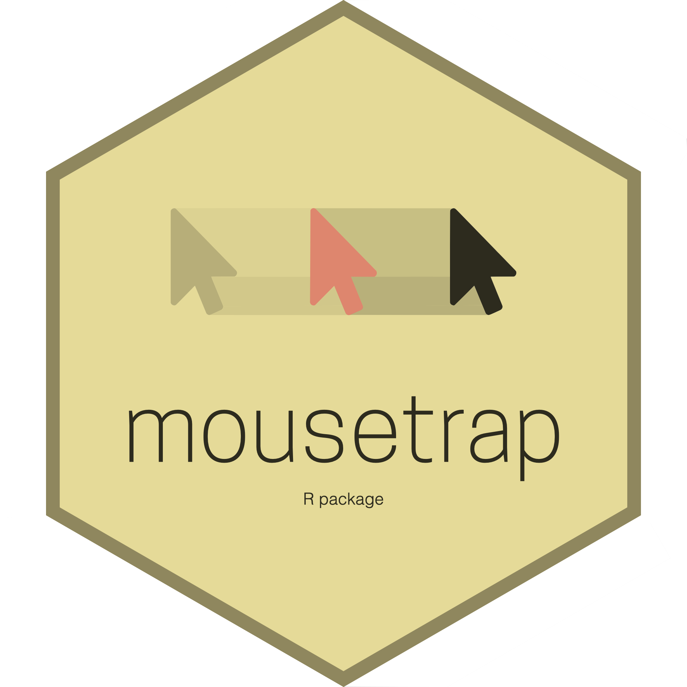

<!-- README.md is generated from README.Rmd. Please edit that file -->

# mousetrap 

Mouse-tracking, the analysis of mouse movements in computerized
experiments, is a method that is becoming increasingly popular in the
cognitive sciences. The `mousetrap` package offers functions for
importing, preprocessing, analyzing, aggregating, and visualizing
mouse-tracking data.

## General Information

The `mousetrap` package is developed by Pascal Kieslich, Dirk Wulff,
Felix Henninger, and Jonas Haslbeck. It is published under the GNU
General Public License (version 3).

An overview of the functions in this package can be found
[online](http://pascalkieslich.github.io/mousetrap/reference/mousetrap.html).
It can also be accessed from within R using `?mousetrap` once the
package has been loaded. Please see
[news](http://pascalkieslich.github.io/mousetrap/news/) for a summary of
changes in the package. Questions about using `mousetrap` can be asked
in the
[forum](https://forum.cogsci.nl/index.php?p=/categories/mousetrap).

The `mousetrap` package offers functions for importing mouse-tracking
data in different formats and from various sources. One option to
collect mouse-tracking data is by using the open-source graphical
experiment builder [OpenSesame](https://osdoc.cogsci.nl/) in combination
with the [mousetrap-os
plugin](https://github.com/pascalkieslich/mousetrap-os).

## Installation

The current stable version is available on CRAN and can be installed via
`install.packages("mousetrap")`.

To install the latest development version from GitHub, you need the
`devtools` package . The development version can be installed via
`devtools::install_github("pascalkieslich/mousetrap@master")`.

## Questions

Questions about using `mousetrap` can be asked in the
[forum](https://forum.cogsci.nl/index.php?p=/categories/mousetrap).

## Citation

If you use the `mousetrap` package in your published research, we kindly
ask that you cite the associated preprint:

Wulff, D. U.\*, Kieslich, P. J.\*, Henninger, F., Haslbeck, J. M. B., &
Schulte-Mecklenbeck, M. (in press). *Movement tracking of psychological
processes: A tutorial using mousetrap.* Behavior Research Methods.
<https://doi.org/10.31234/osf.io/v685r>

## Acknowledgments

We thank Johanna Hepp for helpful comments on the documentation of this
package and Monika Wiegelmann for testing a development version. This
work was supported by the University of Mannheim’s Graduate School of
Economic and Social Sciences, which is funded by the German Research
Foundation.
